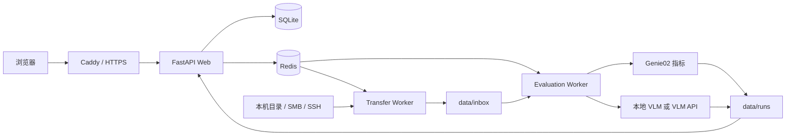

# VLA Evaluation

一个用于 VLA（Vision-Language-Action）真机数据评测的 Web 平台。它能导入 Genie02 Native 或 LeRobot 数据集，异步计算 GSR、TTS 和轨迹平滑度，可选调用 VLM 分析抓取尝试，最后在浏览器中查看和下载评测报告。

> 当前可运行版本在 `feature/vla-eval-web-vlm-api-backend` 分支。

快速导航：[本机跑起来](#本机开发模式) · [导入与评测](#第一次导入和评测) · [VLM 配置](#vlm-怎么选) · [4090 部署](#ubuntu-4090-docker-compose-部署) · [常见问题](#常见问题)

## 你可以用它做什么

- 通过受控本机目录、SMB/NAS 挂载目录或 SSH 远程源导入数据集。
- 导入前检查格式、Episode 数量和文件指纹。
- 用 Redis + RQ 异步执行传输和评测，关闭浏览器不会丢失任务。
- 生成 GSR、成功 Episode 的 TTS、平滑度、失败明细和逐 Episode 指标。
- 支持本地 Qwen2.5-VL GPU 后端和 OpenAI 兼容的 VLM API。
- 在 Web 报告中查看交互式趋势与异常 Episode，并下载 JSON、CSV、Markdown 和 SVG 产物。
- 支持数据集与任务的关键词搜索、排序、归档和恢复。

## 系统是怎么运行的



Web 进程负责页面和任务调度，`transfer-worker` 负责复制和校验数据，`evaluation-worker` 负责指标、VLM 和报告。数据集、任务状态和报告都保存在服务器上，不保存在浏览器中。

## 先选择运行方式

| 目标 | 适合方式 | GPU |
|---|---|---|
| 在 Mac/Linux 上了解项目、导入数据、生成基础报告 | [本机开发模式](#本机开发模式) | 不需要，创建任务时不启用 VLM |
| 本机评测，VLM 由云端或内网 API 处理 | 本机开发模式 + `genie02-api` | 本机不需要 |
| 在 Ubuntu 4090 服务器上长期运行 | [Docker Compose 部署](#ubuntu-4090-docker-compose-部署) | 默认 Compose 需要；API-only 需另外去掉 GPU 镜像和设备声明 |

## 环境要求

| 组件 | 要求 | 说明 |
|---|---|---|
| Python | `3.11.x` | 项目约束为 `>=3.11,<3.12` |
| Redis | 可连接的 Redis 服务 | 保存 RQ 任务队列 |
| GNU rsync | `>= 3.2.7` | 本机目录和 SSH 导入使用；macOS 自带旧版通常不符合 |
| 操作系统 | macOS / Linux | 生产手册以 Ubuntu 22.04 为准 |

本地 GPU VLM 额外需要 NVIDIA GPU、可用驱动、NVIDIA Container Toolkit 和模型权重。

## 本机开发模式

这条路径先跑通不含 VLM 的完整业务流程。不要在没有 GPU 依赖的 Mac 上选择 `genie02-full + 启用 VLM`。

### 1. 下载代码

```bash
git clone --branch feature/vla-eval-web-vlm-api-backend --single-branch https://github.com/mzx1311072278/vla-evaluation.git
cd vla-evaluation
```

### 2. 安装基础软件

macOS + Homebrew：

```bash
brew install python@3.11 redis rsync
brew services start redis
```

Linux 需要安装 Python 3.11、Redis 和 GNU rsync，并确保 Redis 已启动。然后检查：

```bash
python3.11 --version
redis-cli ping
rsync --version | head -n 1
```

成功标志：Redis 输出 `PONG`，rsync 版本不低于 `3.2.7`。

### 3. 创建 Python 环境

```bash
python3.11 -m venv .venv
.venv/bin/python -m pip install --upgrade pip
.venv/bin/python -m pip install -e '.[dev,vlm-api]'
```

### 4. 生成本机配置

以下命令把运行数据放在已忽略的 `data/dev/` 中。默认允许从当前账号的 `Downloads` 目录导入；也可以先设置其他绝对路径为 `VLA_EVAL_SOURCE_ROOT`。

```bash
VLA_EVAL_PROJECT_ROOT="$(pwd -P)"
VLA_EVAL_DEV_ROOT="$VLA_EVAL_PROJECT_ROOT/data/dev"
VLA_EVAL_SOURCE_ROOT="${VLA_EVAL_SOURCE_ROOT:-$HOME/Downloads}"
VLA_EVAL_DEV_SECRET="$(openssl rand -hex 32)"

mkdir -p "$VLA_EVAL_DEV_ROOT"/{db,inbox,runs,staging,credentials,models}
mkdir -p "$VLA_EVAL_SOURCE_ROOT"

cat > "$VLA_EVAL_DEV_ROOT/app.yaml" <<YAML
data_root: "$VLA_EVAL_DEV_ROOT"
database_url: "sqlite:///$VLA_EVAL_DEV_ROOT/db/app.sqlite3"
redis_url: "redis://127.0.0.1:6379/0"
session_secret: "$VLA_EVAL_DEV_SECRET"
local_sources:
  this-computer:
    roots:
      - "$VLA_EVAL_SOURCE_ROOT"
remote_sources: {}
YAML

cat > "$VLA_EVAL_DEV_ROOT/env.sh" <<EOF
export VLA_EVAL_CONFIG='$VLA_EVAL_DEV_ROOT/app.yaml'
export VLA_EVAL_PROFILES_ROOT='$VLA_EVAL_PROJECT_ROOT/config/profiles'
export VLA_EVAL_CREDENTIALS_ROOT='$VLA_EVAL_DEV_ROOT/credentials'
EOF

chmod 600 "$VLA_EVAL_DEV_ROOT/app.yaml" "$VLA_EVAL_DEV_ROOT/env.sh"
source "$VLA_EVAL_DEV_ROOT/env.sh"
unset VLA_EVAL_DEV_SECRET
```

### 5. 初始化数据库和登录账号

项目没有写死的默认账号。下面的 `admin` 和密码只是示例：

```bash
source data/dev/env.sh
.venv/bin/python -m vla_eval.cli init-db

export VLA_EVAL_INITIAL_PASSWORD='replace-with-your-password'
.venv/bin/python -m vla_eval.cli create-user admin --admin
unset VLA_EVAL_INITIAL_PASSWORD

.venv/bin/python -m vla_eval.cli smoke
```

成功标志：看到 `database initialized`、`created user 'admin'` 和 `smoke ok`。

### 6. 启动三个进程

打开三个终端，每个终端都先进入项目目录并执行 `source data/dev/env.sh`。

```bash
# 终端 A：Web
.venv/bin/uvicorn vla_eval.server:create_app_from_env --factory --host 127.0.0.1 --port 8000

# 终端 B：数据传输 Worker
.venv/bin/python -m vla_eval.cli worker --queue transfers

# 终端 C：评测 Worker
.venv/bin/python -m vla_eval.cli worker --queue evaluations
```

验证：

```bash
curl -fsS http://127.0.0.1:8000/health
```

成功标志：输出 `{"status":"ok"}`。然后打开 [http://127.0.0.1:8000](http://127.0.0.1:8000)，用第 5 步创建的账号登录。

## 第一次导入和评测

### 数据集要求

系统支持两类输入：

1. **Genie02 Native Session**：根目录至少包含 `session.json` 和 `episodes.csv`，轨迹通常为 NPZ。
2. **LeRobot 数据集**：包含 `meta/info.json`、Episode 元数据和 Parquet 数据；需要视频时，视频引用也必须有效。

更详细的 Native 字段和指标公式见 [Genie02 评测工具说明](Genie02_report/README.md)。

### Web 界面如何填

假设配置中 `this-computer` 的根目录是 `/Users/you/Downloads`，你的数据集是：

```text
/Users/you/Downloads/fangdianlang_data/fangdianlang_good_only_ee
```

在“新建导入”页面填：

| 字段 | 填写内容 |
|---|---|
| 来源 | `this-computer` |
| 根目录 | `/Users/you/Downloads` |
| 相对路径 | `fangdianlang_data/fangdianlang_good_only_ee` |
| 目标名称 | 例如 `fangdianlang_good_only_ee` |

这里不上传浏览器附件。Transfer Worker 从它能看到的受控目录中复制数据，校验后放入 `data_root/inbox`。部署到远程服务器后，“本地目录”指的是 **Transfer Worker 所在服务器** 的目录，不是打开浏览器的电脑。

数据集状态变为 `READY` 后：

1. 进入“评测任务”并新建任务。
2. 选择刚导入的数据集。
3. 本机无 GPU 快速验证时，选 `genie02-full` 但**不启用 VLM**。
4. 启动任务，等待状态变为 `SUCCEEDED`。
5. 打开报告，核对 Episode 总数、成功/失败数、GSR、TTS 和平滑度。

## VLM 怎么选

### 方式 A：4090 本地模型

本地后端提供两个独立 Profile：

- `genie02-full`：Qwen2.5-VL-7B-Instruct，`model_family: qwen2_5_vl`。
- `genie02-qwen3-vl`：Qwen3-VL-8B-Instruct，`model_family: qwen3_vl`。

两者都要求：

- `vlm.backend: local`。
- `vlm.model_path` 必须是 Evaluation Worker 容器内可见的模型目录。
- 创建评测时选择对应 Profile 并启用 VLM。
- 运算在 Evaluation Worker 所在的 4090 上完成。

不要把 Qwen3 纯文本模型配置为 VLM；必须使用 Qwen3-VL Instruct checkpoint。

### 任务级摄像头选择与资源保护

启用 VLM 后，新建评测页面会列出数据集检查阶段发现的摄像头。摄像头列表会随任务保存，任务开始后不会再次根据当前页面选择重新发现：

- 不勾选时默认使用数据集的全部摄像头；单个任务最多 3 路。若数据集超过 3 路，必须明确勾选不超过 3 路后提交。
- 同一个 Episode 的所选视角会合并到一次 VLM 请求中；每路仍独立使用当前抽帧上限（默认全局 8 帧 + dense 8 帧），所以 3 路最多会发送 48 张图片。
- 本地后端在 Processor 完成后读取真实 `input_ids` 长度，并检查 `input_tokens + max_new_tokens <= context_limit`。超限的 Episode 会记录 `context_length_exceeded`，不会调用 `generate`。
- 本地后端每个 Episode 记录 `cuda_peak_memory_allocated_bytes` 和 `cuda_peak_memory_reserved_bytes`；API 后端无法观测 Worker 显存，这四个资源字段按不可用处理。

建议第一次在 RTX 4090 上用只包含 1 个 Episode 的测试数据集做三路 smoke test，确认 Evaluation Worker 日志、Episode JSON 中的 `sampled_frame_count_by_camera` 和显存峰值，再扩大任务范围。上下文 token 没有超限不代表显存一定足够，真实峰值仍以 Worker 记录为准。

### 方式 B：OpenAI 兼容 API

修改私有副本，不要向 Git 提交公司内网地址或密钥：

```bash
mkdir -p data/dev/profiles
cp config/profiles/*.yaml data/dev/profiles/
```

修改关键内容：

```yaml
name: genie02-api
vlm:
  backend: api
  api:
    base_url: https://your-vlm-host.example/v1
    model: your-vision-model-id
    api_key_env: VLA_EVAL_VLM_API_KEY
```

`base_url` 是 API 根地址，系统会请求它下面的 `/chat/completions`。把密钥只放在 Worker 环境变量中：

```bash
cat >> data/dev/env.sh <<EOF
export VLA_EVAL_PROFILES_ROOT='$(pwd -P)/data/dev/profiles'
export VLA_EVAL_VLM_API_KEY='replace-with-real-secret'
EOF
chmod 600 data/dev/env.sh
source data/dev/env.sh
```

重启 Evaluation Worker，创建任务时选择 `genie02-api` 并启用 VLM。`data/dev/` 已被 Git 忽略，但这个 `env.sh` 仍应保持 `600` 权限。密钥值不会写入数据库或报告；报告只保存环境变量名称和非机密配置。

> 仓库自带的 `docker-compose.yml` 面向 4090：Evaluation Worker 使用 CUDA 基础镜像并申请 NVIDIA 设备。纯 API、无 GPU 的服务器需要改用只安装 `.[vlm-api]` 的镜像，并删除 Compose 中的 GPU device reservation；不要直接照搬默认 Compose。

## Ubuntu 4090 Docker Compose 部署

这里给出可执行主路径。NVIDIA 驱动、SSH/SMB、备份和崩溃恢复的完整说明见 [Ubuntu 22.04 + RTX 4090 部署手册](docs/deployment/ubuntu-22.04.md)。

### 1. 宿主机准备

需要 Ubuntu 22.04 LTS、NVIDIA 驱动、Docker Engine、Compose v2 和 NVIDIA Container Toolkit。先检查：

```bash
nvidia-smi
docker --version
docker compose version
df -h
```

### 2. 下载代码和创建目录

```bash
sudo mkdir -p /srv/vla-eval/{config/profiles,data/db,data/credentials,data/inbox,data/runs,data/staging,logs,models,secrets}
sudo install -d -m 755 -o "$USER" -g "$(id -gn)" /srv/vla-eval/app
sudo chown -R 1001:1001 /srv/vla-eval/{config,data,logs,models,secrets}
sudo chmod 700 /srv/vla-eval/secrets /srv/vla-eval/data/credentials

git clone --branch feature/vla-eval-web-vlm-api-backend --single-branch https://github.com/mzx1311072278/vla-evaluation.git /srv/vla-eval/app
cd /srv/vla-eval/app
```

容器使用固定 uid/gid `1001:1001`。数据目录权限不正确时，Web 健康检查和 Worker 都会失败。

### 3. 安装配置和 Profile

```bash
sudo install -m 640 -o 1001 -g 1001 config/app.example.yaml /srv/vla-eval/config/app.yaml
sudo install -m 640 -o 1001 -g 1001 config/profiles/*.yaml /srv/vla-eval/config/profiles/
cp .env.example .env
chmod 600 .env
```

编辑 `/srv/vla-eval/config/app.yaml`：

- `data_root` 保持为 `/srv/vla-eval/data`。
- SQLite 保持为 `sqlite:////srv/vla-eval/data/db/app.sqlite3`。
- Redis 保持为 `redis://redis:6379/0`。
- 本地数据源必须和 Compose 中 Transfer Worker 的挂载一致，默认是 `/mnt/vla-datasets`。
- 不用 SSH 远程源时，把示例 `remote_sources` 改为 `{}`。

编辑 `.env`，至少填：

```dotenv
VLA_EVAL_SESSION_SECRET=<openssl rand -hex 32 的输出>
VLA_EVAL_CONFIG=/srv/vla-eval/config/app.yaml
VLA_EVAL_PROFILES_ROOT=/srv/vla-eval/config/profiles
VLA_EVAL_CREDENTIALS_ROOT=/srv/vla-eval/data/credentials
VLA_EVAL_GIT_SHA=<git rev-parse HEAD 的输出>
```

使用 API VLM 时再填 `VLA_EVAL_VLM_API_KEY`。不要把 `.env`、SSH 私钥或真实 API 密钥提交到 Git。

### 4. 挂载数据和模型

- 把本机、SMB 或 NAS 数据挂载到宿主机 `/mnt/vla-datasets`。
- Compose 会以只读方式把它挂载到 Transfer Worker。
- 使用 Qwen2.5-VL 时，把模型放到 `/srv/vla-eval/models/Qwen2.5-VL-7B-Instruct`。
- 使用 Qwen3-VL 时，把模型放到 `/srv/vla-eval/models/Qwen3-VL-8B-Instruct`。
- Evaluation Worker 中的对应路径统一位于 `/srv/vla-eval/data/models/`。

系统不会直接在 `/mnt/vla-datasets` 上评测。它先复制到 staging，通过预检后发布到 `/srv/vla-eval/data/inbox`。

### 5. 配置 HTTPS 域名

修改 `deploy/Caddyfile` 中的 `vla-eval.local`，替换为服务器内网域名。如果仍使用 `vla-eval.local`，客户端需要用 DNS 或 hosts 文件把它指向 4090 服务器 IP。

Caddy 使用内部 CA 签发证书。正式使用时应把 Caddy 根证书安装到访问者的信任库，而不是长期忽略浏览器警告。

### 6. 构建并启动

Transfer Worker 镜像继承自 `vla-eval-web:latest`，所以必须先构建 Web：

```bash
docker compose config --quiet
docker compose build web
docker compose build
docker compose up -d
docker compose ps
```

首次创建管理员：

```bash
docker compose run --rm \
  -e VLA_EVAL_INITIAL_PASSWORD='replace-with-a-strong-password' \
  web python -m vla_eval.cli create-user admin --admin
```

检查数据库、Redis 和数据目录：

```bash
docker compose run --rm web python -m vla_eval.cli smoke
```

### 7. 部署验收

```bash
# 容器状态
docker compose ps

# Web 健康检查；根据你的域名替换 vla-eval.local
curl -kfsS --resolve vla-eval.local:443:127.0.0.1 https://vla-eval.local/health

# 4090 对容器可见
docker compose run --rm evaluation-worker nvidia-smi

# PyTorch 对 CUDA 可见
docker compose run --rm evaluation-worker python -c "import torch; assert torch.cuda.is_available(); print(torch.cuda.get_device_name(0))"
```

成功标志：

- `web`、`redis`、`transfer-worker`、`evaluation-worker` 和 `caddy` 都在运行，Web/Redis 健康。
- `/health` 输出 `{"status":"ok"}`。
- `nvidia-smi` 和 PyTorch 都显示 RTX 4090。
- 浏览器能打开 HTTPS 页面并使用新建账号登录。
- 实际导入一个小数据集，完成一次评测，报告 Episode 数与源数据一致。

## 常用管理命令

```bash
docker compose logs -f web
docker compose logs -f transfer-worker
docker compose logs -f evaluation-worker

docker compose restart web
docker compose restart transfer-worker evaluation-worker

# 崩溃或重启后标记中断任务
docker compose run --rm web python -m vla_eval.cli recover-jobs

# 重新扫描 inbox
docker compose run --rm web python -m vla_eval.cli scan-datasets

# 停止服务，保留持久化卷和宿主机数据
docker compose down
```

## 数据和权限说明

- 同一套部署使用同一个 SQLite 数据库和数据目录。当前不是按账号隔离数据的多租户系统：不同账号会看到同一部署中的共享数据集、任务和报告。
- “归档”只从默认列表隐藏记录，不删除原始数据或历史报告。
- 数据集导入后会复制到 `data_root/inbox`，请预留足够磁盘空间。
- API 密钥、Session secret、SSH 私钥和数据库不应进入 Git。

## 常见问题

### 页面打不开

1. 本机先运行 `curl http://127.0.0.1:8000/health`。
2. 确认 Redis 在运行。
3. 确认 Web 终端加载了 `data/dev/env.sh`。
4. Docker 部署检查 `docker compose ps` 和 `docker compose logs web`。

### 没有可用账号

系统没有默认用户。运行 `python -m vla_eval.cli create-user ...`。如果提示用户已存在，不会覆盖原密码。

### 数据集路径不合法

- 界面只接受管理员在 `local_sources` / `remote_sources` 中配置的源。
- 数据集路径必须是配置根目录下的相对路径，不能包含 `..`。
- 远程部署中，路径必须对 Transfer Worker 可见。
- 检查 `rsync --version`，需要 GNU rsync 3.2.7 或更高版本。

### 任务一直是 QUEUED

队列已接收任务，但对应 Worker 没有消费。检查 `transfer-worker` 或 `evaluation-worker` 进程与日志。

### VLM 未产生结果

- 确认创建任务时已启用 VLM。
- 确认所选 Profile 的 `vlm.backend` 是 `local` 或 `api`。
- 本地后端检查模型族、模型路径、`config.json`、CUDA 和 GPU 依赖。
- API 后端检查 `base_url`、模型 ID、`VLA_EVAL_VLM_API_KEY` 和 Evaluation Worker 是否已重启。
- “VLM 已配置”不等于“VLM 本次启用”，也不等于“VLM 结果产物已生成”。

### HTTPS 提示证书不可信

Caddy 默认使用内部 CA。导出并安装 Caddy 根证书，或改用公司已信任的证书。`curl -k` 只用于首次部署验收。

## 测试与静态检查

```bash
.venv/bin/python -m playwright install chromium
.venv/bin/pytest -q
.venv/bin/ruff check Genie02_report vla_eval tests

# 需要 Docker
docker compose config --quiet
```

## 主要目录

```text
vla_eval/                    Web、数据库、队列、导入和评测服务
vla_eval/web/                Jinja2 页面、路由与样式
Genie02_report/              Episode 指标、核心指标、VLM 分析和报告
config/profiles/             评测 Profile（本地 VLM / API VLM）
deploy/                      Dockerfile、Caddy、入口脚本和备份脚本
docs/deployment/             生产部署和运维手册
tests/                       单元、Web、端到端和视觉布局测试
vla_real_robot_evaluation/   真机评测调研和系统框架资料
```

## 进一步阅读

- [Genie02 指标、数据格式与命令行工具](Genie02_report/README.md)
- [Ubuntu 22.04 + RTX 4090 完整部署手册](docs/deployment/ubuntu-22.04.md)
- [VLA 真机评测调研](vla_real_robot_evaluation/README.md)
